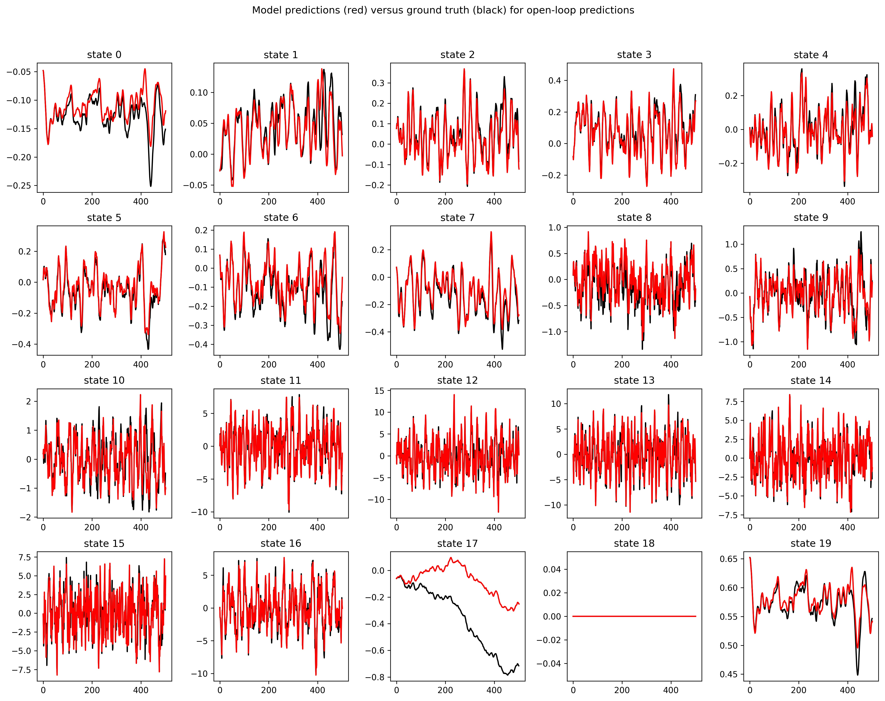
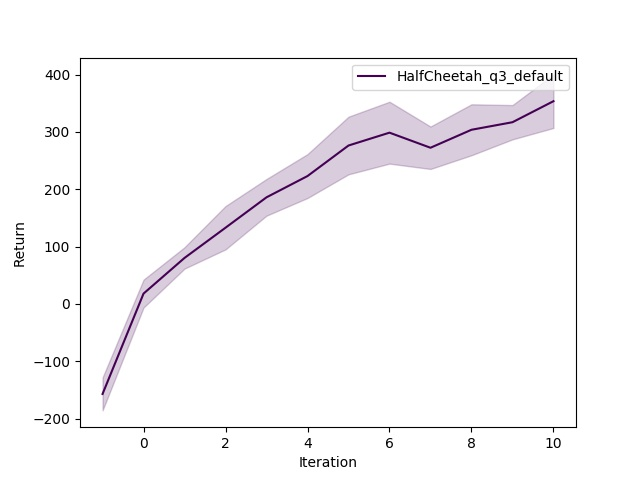
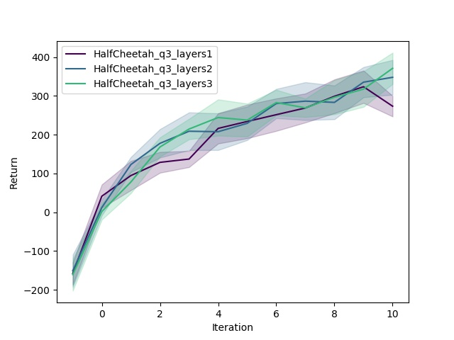
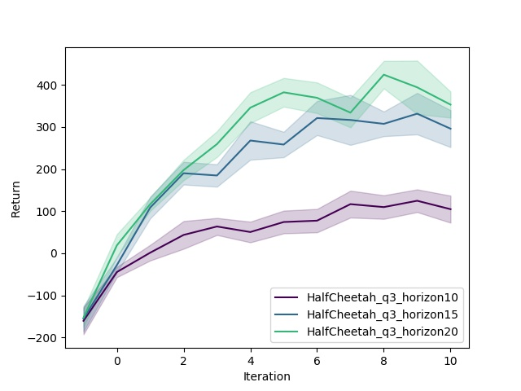
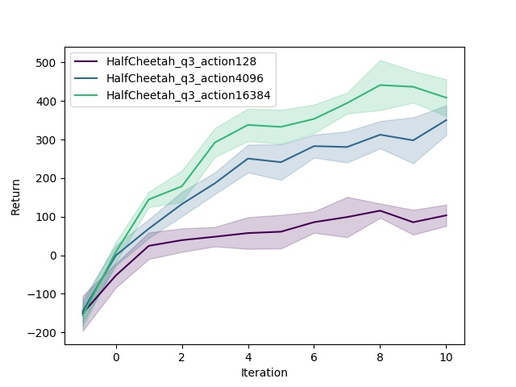

# CS294-112 HW 4: Model Based RL

This is a completed homework number 4 from CS294-112 (2018)

The results can be reproduced by running: bash run_all.sh \
Problem statements : [HW4.pdf](hw4.pdf) \
Homework report : [HW4_report.pdf](HW4_report.pdf) 

#### PROBLEM 1

In every dimension except 17th the predictions of the model are almost exactly the same as the ground truth. In state dimension #17 predictions are getting much different from the truth : small errors accumulated over time because each successive state was predicted based on erroneous previous state

#### PROBLEM 2

Comparison of the performance of the model based controller trained on a random data versus the random policy:

Reward / Policy |Model Based Controller | Random Policy
 --- | --- | ---
ReturnAvg | -162.79|28.00
ReturnStd |-11.47 | 19.30

#### PROBLEM 3(A)

Model Based RL policy return increases with iterations


#### PROBLEM 3(B)

Comparing performance for varying [number of nn layers, length of MPC horizon, number of ranom actions] 


